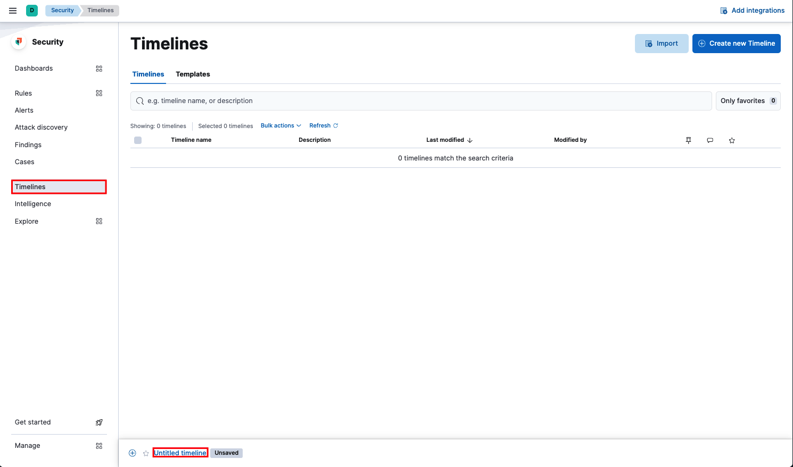
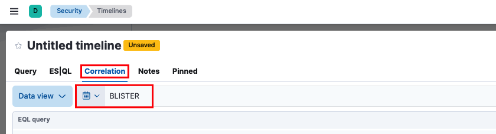

# Objectives
In this section, you will:
- Create EQL queries in order to hunt for network-specific events
- Utilize your EQL queries to answer questions in the Questions tab

# Lab Parameters
- Navigate to **Timelines** and select **Untitled timeline** at the bottom of the screen.

- Select the **Correlation** tab and set your time picker to `BLISTER`.

Query 1: Big Data
===

Data exfiltration is one of many goals of attackers in your networks; you have information that they want. Identifying possible data exfiltration is essential in maintaining the integrity of your intellectual property.

**Task:** Create and run an EQL query to identify connections where over `100MB (100,000,000 Bytes)` were sent by the `Source IP`. Use this query to answer "Big Data" in the [button label="Questions"](Questions) tab.

Hints

- The field `source.bytes` corresponds to data sent by the `Source IP`

Query 2: Don't use that!
===

In the modern internet, all network traffic should be encrypted; you can get some "easy wins" by running a simple search for common insecure protocols that may have slipped past our security controls.

**Task:** Create and run an EQL query to find **both** `HTTP` and `FTP` traffic. Only show logs that were collected by the endpoint agent. Use this query to answer "Don't use that!" in the [button label="Questions"](Questions) tab.

Hints

- `network.protocol` is the field we need to use for the network service
- A query that is search for *both* HTTP and FTP traffic will require we use an `or` statement
- `event.dataset` is the field to search for logs collected by the endpoint agent
- You may want to use a `:` to find where `event.dataset` contains endpoint

Query 3: Don't look at me!
===

Now combine the previous two principles and find larger connections over insecure protocols.

## Create an EQL query to find insecure HTTP and FTP where the Source IP sent more than 1MB of data. Use this query to answer "Don't look at me!" in [button label="Questions"](Questions)

Hints

- We can essentially combine the last 2 queries for this one!

Conclusion
===

Nicely done! In this lesson, you created some queries to specifically find network events with EQL.

Next you will take a try at creating host-specific queries.
Select `Check` to continue once you have completed the assignments in the [button label="Questions"](Questions) tab.
